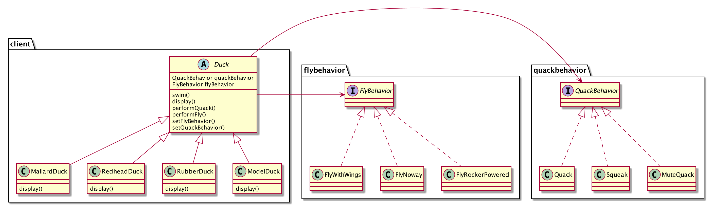
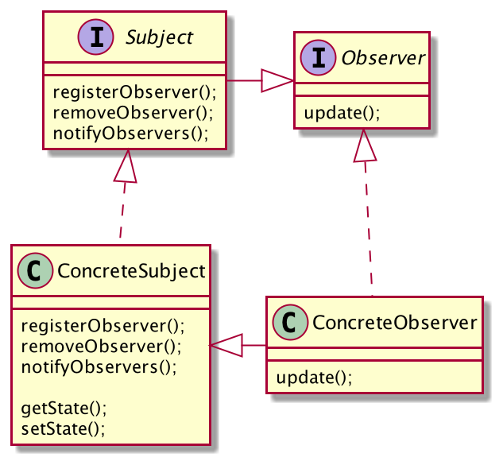
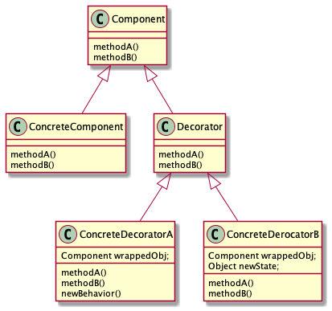
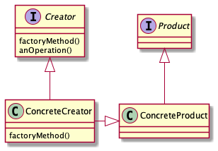
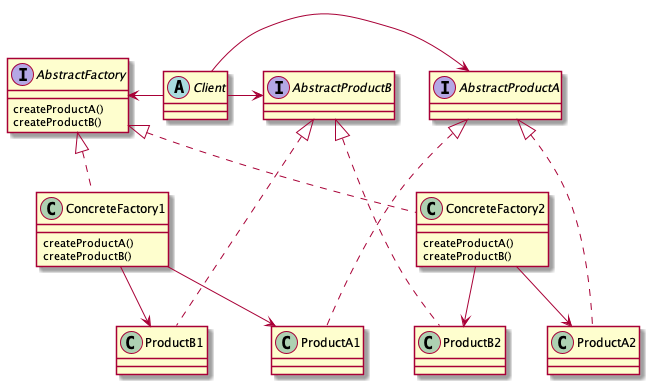
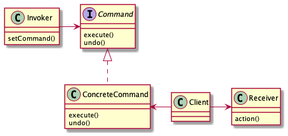
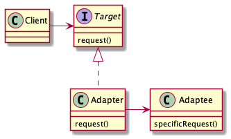
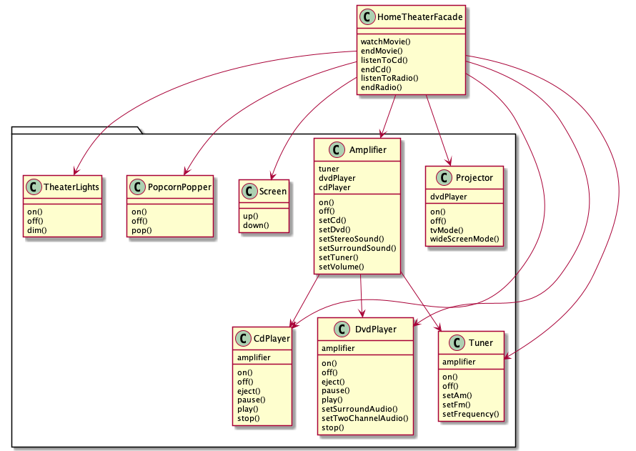

# HeadFirst Design Pattern

This repository is for sample code of [HeadFirst Design Patterns](https://www.amazon.com/Head-First-Design-Patterns-Brain-Friendly/dp/0596007124)

---

## Contents

[Strategy Pattern](#Strategy-Pattern)

[Observer Pattern](#Observer-Pattern)

[Decorator Pattern](#Decorator-Pattern)

[Factory Pattern](#Factory-Pattern)

[Singleton Pattern](#Singleton-Pattern)

[Command Pattern](#Command-Pattern)

[Adapter Pattern](#Adapter-Pattern)

[Facade Pattern](#Facade-Pattern)

---

## Strategy Pattern

[Strategy Pattern](./strategy-pattern)

"Compositon over Inheritence"

---

## Observer Pattern

[Observer Pattern](./observer-pattern)

---

## Decorator Pattern

[Decorator Pattern](./decorator-pattern)

---

## Factory Pattern

[Factory Pattern](./factory-pattern)

1. Factory Method Pattern

2. Abstract Factory Pattern

---

## Singleton Pattern

[Singleton Pattern](./singleton-pattern)

No Image :<

---

## Command Pattern

[Command Pattern](./command-pattern)

---

## Adapter Pattern

[Adapter Pattern](./adapter-pattern)

---

## Facade Pattern

[Facade Pattern](./facade-pattern)

