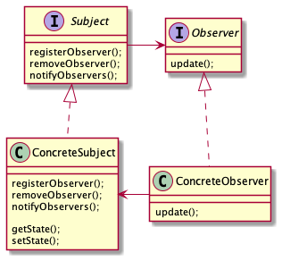

# HeadFirst Design Pattern

This repository is for sample code of [HeadFirst Design Patterns](https://www.amazon.com/Head-First-Design-Patterns-Brain-Friendly/dp/0596007124)

## Contents

[Strategy Pattern](./strategy-pattern)

"Compositon over Inheritence"

[Observer Pattern](./observer-pattern)

[Decorator Pattern](./decorator-pattern)

[Factory Pattern](./factory-pattern)

1. Factory Method Pattern

2. Abstract Factory Pattern

[Singleton Pattern](./singleton-pattern)

No Image :<

[Command Pattern](./command-pattern)

[Adapter Pattern](./adapter-pattern)

